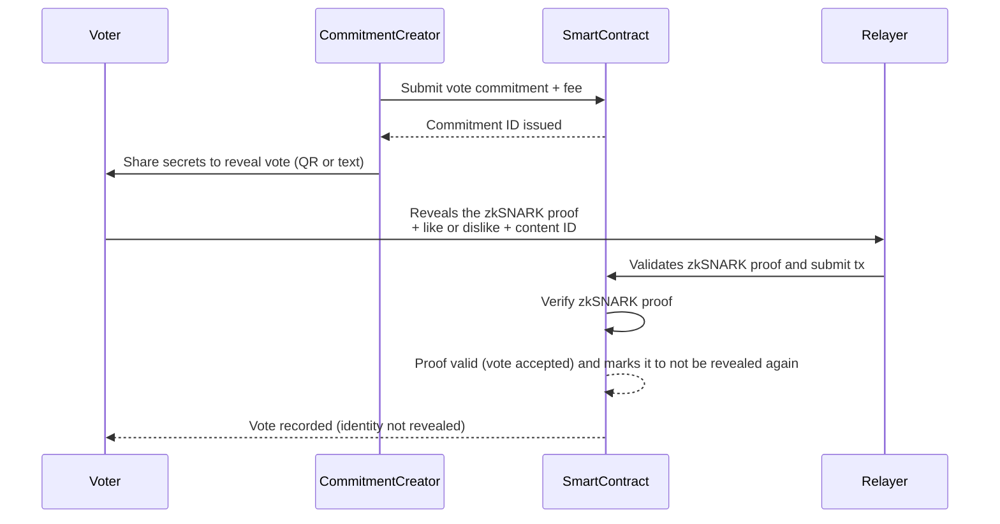

# Utonoma

## 1. What is Utonoma?  

**Utonoma** is a decentralized social network like no other.  
It runs entirely on blockchain and allows content creators to **earn cryptocurrency for each like** they receive.  

The twist?  
- If content gets too many dislikes, it will be removed from the platform.  
- This creates a system of **democratic and decentralized moderation**, shaping a freer and fairer internet.  

### ✨ Key Features  
- 📝 **Post Content**: Share content or proof of positive actions.  
- 👍 **Community Voting**: Likes reward creators, dislikes can remove content.  
- 💰 **Crypto Rewards**: Earn native tokens for valuable contributions.  
- 🗳 **Democratic Moderation**: No centralized censorship, decisions come from the community.  
- 📂 **IPFS Integration**: Content hosted in a censorship-resistant way.  
- ⚖️ **Fair Incentives**: Adaptive token issuance to prevent inflation.  

👉 [Read the Whitepaper (English)](https://blog.utonoma.com/wp-content/uploads/2024/04/utonoma_en.pdf)  

---

## 2. What is Utonoma zkVotes?  

While the original Utonoma ensures decentralized moderation, it has a **privacy limitation**:  
- On-chain votes (likes/dislikes) are public.  
- If a user’s wallet is linked to their real identity, anyone can see what they support or reject.  

⚠️ This compromises free expression and can create **political or social pressure**.  

**Utonoma zkVotes** solves this problem by integrating **zero-knowledge proofs**:  
- Votes are submitted privately as commitments.  
- zk-SNARKs prove the vote is valid **without revealing** who voted, what they voted for, or when.  
- Only the final tally is visible, ensuring **privacy-preserving, democratic moderation**.  

---

## 3. How the Solution Works  

1. Anyone can create vote commitments with **zk-proofs**, based on secret keys.  
2. These commitments (**blank ballots**) are uploaded to the smart contract, paying the respective voting fee.  
3. They are distributed to users via **QR codes or text** (secrets + commitments).  
4. When voting:  
   1. User calls a **relayer service** to reveal the blank ballot.  
   2. They attach **like/dislike + content ID + zkSNARK proof**.  
   3. The relayer submits the transaction (paying for the gas).  
5. The smart contract **verifies the zkSNARK** and records the vote, marking it to not be revealed again.  

**Result:** No link between the voter, their real account, or their real identity.  



Here is a demo on how it works:
https://youtu.be/Nia5ICcm_0Q


# Hackathon Judges Guide

Welcome, judges! This guide will walk you through setting up and testing the Utonoma voting dApp on the Avalanche Fuji testnet.

## Prerequisites

Before you begin, please ensure you have the following:

-   **Node.js** installed on your machine.
-   A Web3 wallet browser extension (e.g., **Core Wallet** or MetaMask) configured for the **Avalanche Fuji Testnet**.
-   **Testnet AVAX** in your wallet for gas fees.
-   **test_utomi tokens** for voting fees. Please email [adrian.sequeira@utonoma.com](mailto:adrian.sequeira@utonoma.com) to request these.

---

## 1. Run the Frontend

1.  Clone the project and navigate to its directory:
    ```bash
    git clone <your-repo-url>
    cd <your-repo-directory>
    ```

2.  Navigate to the frontend folder and install its dependencies:
    ```bash
    cd frontend
    npm install
    ```

3.  Start the development server:
    ```bash
    npm run start
    ```
    The application will open in your browser at `http://localhost:3000`.

## 2. Load the Smart Contract in Remix IDE

1.  Open the [Remix IDE](https://remix.ethereum.org/).
2.  In the **File Explorer** panel, upload the `./contracts` folder from this project.
3.  Open the `Utonoma.sol` contract file.
4.  Go to the **Solidity Compiler** tab:
    -   Select compiler version `0.8.22`.
    -   Open **Advanced Configurations** and set the optimization to **200 runs**.
    -   Click **Compile Utonoma.sol**.
5.  Go to the **Deploy & Run Transactions** tab:
    -   Set the **Environment** to `Injected Provider - MetaMask` (or your wallet). If Core Wallet is not listed, select "Customize this list..." and add it.
    -   Ensure your wallet is connected to the **Fuji Testnet**.
    -   In the **At Address** field, paste the contract address: `0xda753C40bcebb2e808D89d57fbE42d2DA51Fd06E`
    -   Click **At Address**. The contract's functions will now appear in the bottom panel.

## 3. Create a Vote Commitment

1.  Open a new terminal and navigate to the `circom` folder of the project:
    ```bash
    cd circom
    ```

2.  Run the script to generate a vote commitment:
    ```bash
    node voteCommitmentGenerator.js
    ```
    This will output a JSON string to the terminal.

3.  Copy the value of the `voteCommitment` field from the output.

4.  In Remix IDE, find the `COMMITVOTE` function in the deployed contract panel. Paste the copied `voteCommitment` value into its field and click **transact**. Confirm the transaction in your wallet (this requires `test_utomi` tokens).

## 4. Reveal Your Vote

1.  **Install SNARKJS** (if not already installed globally):
    ```bash
    npm install -g snarkjs
    ```

2.  **Generate the Witness** (ensure you are in the `circom` directory):
    ```bash
    snarkjs wtns calculate ./LikeOrDislikeCircuit/LikeOrDislikeCircuit.wasm input.json witness.wtns
    ```

3.  **Generate the Proof**:
    ```bash
    snarkjs groth16 prove ./LikeOrDislikeCircuit/LikeOrDislikeCircuit.zkey witness.wtns proof.json public.json
    ```

4.  **Generate the Calldata** for the Solidity function:
    ```bash
    snarkjs generatecall
    ```
    This command will output several arrays.

5.  **Reveal the Vote in Remix**:
    -   Go back to the frontend in your browser, find the "bunny caricature" video, and note its current like/dislike count.
    -   In Remix, find the `revealVote` function.
    -   Copy each array from the `snarkjs generatecall` output into the corresponding fields: `_pA`, `_pB`, `_pC`, and `_pubSignals`.
    -   For the `_id` field, enter `[0,5]` (the ID for the bunny video).
    -   For the `_vote` field, enter `0` for a dislike or `1` for a like.
    -   Click **transact** and confirm the transaction in your wallet.

6.  **Verify the Vote**:
    -   Return to the frontend application and refresh the page.
    -   Find the "bunny in the forest" video again. You should see the like or dislike count increased by one.


# 5. Developer section
You can find a memory of commands used for the development of the solution
📖 How to run the smart contract in local.
**Prerequisite: Install Node js**
1. **Install the npm depencies** → Navigate to the /contracts folder and type in the terminal "npm install" this will install the requred npm packages required.
2. **Compile the smart contract** → Run npx hardhat compile
3. **Run a node of hardhat** → Open another terminal and navitage to the /contracts folder, then type "npx hardhat node", this will start a local blockchain
4. **Deploy the smart contract in a Hardhat local network** → Go back to the first terminal and run "npx hardhat run deploy.js --network localhost"
Now you can make RPC calls via http://127.0.0.1:8545, Chain ID: 31337.
5. **Verify that the server its running** → Go back to the terminal where you executed npx hardhat node and you'll see some messages related to the Utonoma contract being deployed on the new blockchain.

## 📖 How to generate the zkSNARK proofs
1. **Install the npm depencies** → Navigate to the /circom folder and type in the terminal "npm install" this will install the requred npm packages required by the circuit.
2. **Generate the secrets and the vote commitment** → In this same folder, run the command "node voteCommitmentGenerator.js" It will create a file called input.json that is required for the next step (everytime you run this 
command, a new vote commitment and new secrets will be created).
3. **Generate the witness** → Run the command "snarkjs wtns calculate ./LikeOrDislikeCircuit/LikeOrDislikeCircuit.wasm input.json witness.wtns". This will compute a witness with the information of the input.json file and will create a file with the name witness.wtns
4. **Generate the zkSNARK proof and the public signals to validate it** Run the following command:
snarkjs groth16 prove ./LikeOrDislikeCircuit/LikeOrDislikeCircuit.zkey witness.wtns proof.json public.json
It will create the proof.json and the public.json files.

## 📖 How to compile the circuits and create the verification key, the zkey and the the wasm file required to calculate the witness and the verification smart contract


## 📖 How to compile the circuits
**Prerequisite: Install Rust, Node and Circom** Refer to this guide for the installation: https://docs.circom.io/getting-started/installation/
1. **Install the npm depencies** → Navigate to the /circom folder and type in the terminal "npm install" this will install the requred npm packages required by the circuit.
2. **Compile the circuit** → Run circom LikeOrDislikeCircuit.circom --r1cs --wasm --sym --c
3. **Generate the input file for the witness** → Run the command "node voteCommitmentGenerator.js" It will create a file called input.json that is required for the next step.
4. **Generate the witness** → Run the command node ./LikeOrDislikeCircuit_js/generate_witness.js ./LikeOrDislikeCircuit_js/LikeOrDislikeCircuit.wasm input.json witness.wtns
This will compute the witness with WebAssembly
5. **Do the Powers of Tau ceremony** Run the command: 
snarkjs powersoftau new bn128 12 pot12_0000.ptau -v 
and then 
snarkjs powersoftau contribute pot12_0000.ptau pot12_0001.ptau --name="First contribution" -v
Give entropy as the input to this last command
6. **Do the Phase2** Run this command snarkjs powersoftau prepare phase2 pot12_0001.ptau pot12_final.ptau -v
and then this other:
snarkjs groth16 setup LikeOrDislikeCircuit.r1cs pot12_final.ptau LikeOrDislikeCircuit_0000.zkey
Then this:
snarkjs zkey contribute LikeOrDislikeCircuit_0000.zkey LikeOrDislikeCircuit_0001.zkey --name="1st Contributor Name" -v
And after, this:
snarkjs zkey export verificationkey LikeOrDislikeCircuit_0001.zkey verification_key.json
7. **Generate a proof for** 
snarkjs groth16 prove LikeOrDislikeCircuit_0001.zkey witness.wtns proof.json public.json

Validate proof:
snarkjs groth16 verify verification_key.json public.json proof.json

Generate the verification smart contract
snarkjs zkey export solidityverifier LikeOrDislikeCircuit_0001.zkey verifier.sol

snarkjs generatecall
