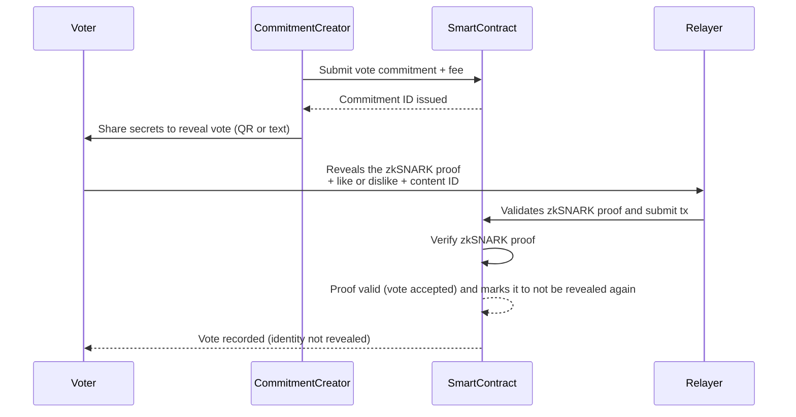

# Utonoma

**Utonoma** is a decentralized social network like no other.  
It runs on blockchain and allows content creators to **earn cryptocurrency for each like** they receive.  

The twist?  
- If content gets too many dislikes, it will be removed from the platform.  
- This creates a system of **democratic and decentralized moderation**, shaping a freer and fairer internet.

---

## ✨ Key Features

- 📝 **Post Content**: Share content or proof of positive actions.  
- 👍 **Community Voting**: Likes reward creators, dislikes can remove content.  
- 💰 **Crypto Rewards**: Earn native tokens for valuable contributions.  
- 🗳 **Democratic Moderation**: No centralized censorship, decisions come from the community.  
- 📂 **IPFS Integration**: Content hosted in a censorship-resistant way.  
- ⚖️ **Fair Incentives**: Token issuance adapts to network activity to avoid inflation.  

---

## 🧩 How It Works

1. **Create content** → Users upload content or documentary evidence of actions.  
2. **Voting** → Other users vote on-chain (likes/dislikes).  
3. **Rewards** → Authors earn cryptocurrency proportional to positive votes.  
4. **Moderation** → If negative votes prevail, content is removed and the author penalized.  

---

## 📖 Whitepaper

The full incentive model and technical details are described in the whitepaper:  
👉 [Utonoma Whitepaper (English)](https://blog.utonoma.com/wp-content/uploads/2024/04/utonoma_en.pdf)

## 📖 How to run the smart contract in local.
**Prerequisite: Install Node js**
1. **Install the npm depencies** → Navigate to the /contracts folder and type in the terminal "npm install" this will install the requred npm packages required.
2. **Compile the smart contract** → Run npx hardhat compile
3. **Run a node of hardhat** → Open another terminal and navitage to the /contracts folder, then type "npx hardhat node", this will start a local blockchain
4. **Deploy the smart contract in a Hardhat local network** → Go back to the first terminal and run "npx hardhat run deploy.js --network localhost"
Now you can make RPC calls via http://127.0.0.1:8545, Chain ID: 31337.
5. **Verify that the server its running** → Go back to the terminal where you executed npx hardhat node and you'll see some messages related to the Utonoma contract being deployed on the new blockchain.

## 📖 How to generate the zkSNARK proofs
1. **Install the npm depencies** → Navigate to the /circom folder and type in the terminal "npm install" this will install the requred npm packages required by the circuit.
2. **Generate the secrets and the vote commitment** → In this same folder, run the command "node voteCommitmentGenerator.js" It will create a file called input.json that is required for the next step (everytime you run this 
command, a new vote commitment and new secrets will be created).
3. **Generate the witness** → Run the command "snarkjs wtns calculate ./LikeOrDislikeCircuit/LikeOrDislikeCircuit.wasm input.json witness.wtns". This will compute a witness with the information of the input.json file and will create a file with the name witness.wtns
4. **Generate the zkSNARK proof and the public signals to validate it** Run the following command:
snarkjs groth16 prove ./LikeOrDislikeCircuit/LikeOrDislikeCircuit.zkey witness.wtns proof.json public.json
It will create the proof.json and the public.json files.

## 📖 How to compile the circuits and create the verification key, the zkey and the the wasm file required to calculate the witness and the verification smart contract

## 📖 How to compile the circuits
**Prerequisite: Install Rust, Node and Circom** Refer to this guide for the installation: https://docs.circom.io/getting-started/installation/
1. **Install the npm depencies** → Navigate to the /circom folder and type in the terminal "npm install" this will install the requred npm packages required by the circuit.
2. **Compile the circuit** → Run circom LikeOrDislikeCircuit.circom --r1cs --wasm --sym --c
3. **Generate the input file for the witness** → Run the command "node voteCommitmentGenerator.js" It will create a file called input.json that is required for the next step.
4. **Generate the witness** → Run the command node ./LikeOrDislikeCircuit_js/generate_witness.js ./LikeOrDislikeCircuit_js/LikeOrDislikeCircuit.wasm input.json witness.wtns
This will compute the witness with WebAssembly
5. **Do the Powers of Tau ceremony** Run the command: 
snarkjs powersoftau new bn128 12 pot12_0000.ptau -v 
and then 
snarkjs powersoftau contribute pot12_0000.ptau pot12_0001.ptau --name="First contribution" -v
Give entropy as the input to this last command
6. **Do the Phase2** Run this command snarkjs powersoftau prepare phase2 pot12_0001.ptau pot12_final.ptau -v
and then this other:
snarkjs groth16 setup LikeOrDislikeCircuit.r1cs pot12_final.ptau LikeOrDislikeCircuit_0000.zkey
Then this:
snarkjs zkey contribute LikeOrDislikeCircuit_0000.zkey LikeOrDislikeCircuit_0001.zkey --name="1st Contributor Name" -v
And after, this:
snarkjs zkey export verificationkey LikeOrDislikeCircuit_0001.zkey verification_key.json
7. **Generate a proof for** 
snarkjs groth16 prove LikeOrDislikeCircuit_0001.zkey witness.wtns proof.json public.json

Validate proof:
snarkjs groth16 verify verification_key.json public.json proof.json

Generate the verification smart contract
snarkjs zkey export solidityverifier LikeOrDislikeCircuit_0001.zkey verifier.sol

snarkjs generatecall
